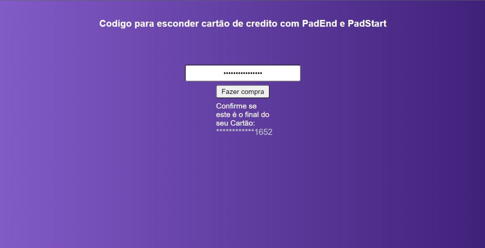

## verificação de ultimos numeros do cartão

Feito para ter como confirmação o ultimos numero do cartão de credito

### Screenshot

### Usado para codificar

- Semantic HTML5 markup
- CSS custom properties
- Flexbox
- Mobile-first workflow

### Continuar desenvolvendo

  Tenho como ambição continuar desenvolvendo para minha melhoria profissional!

## Author

- Frontend Mentor - [@PatrickTav](https://www.frontendmentor.io/profile/PatrickTav)